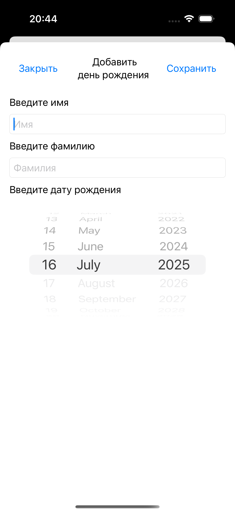
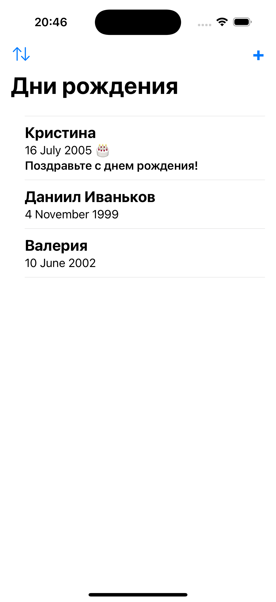
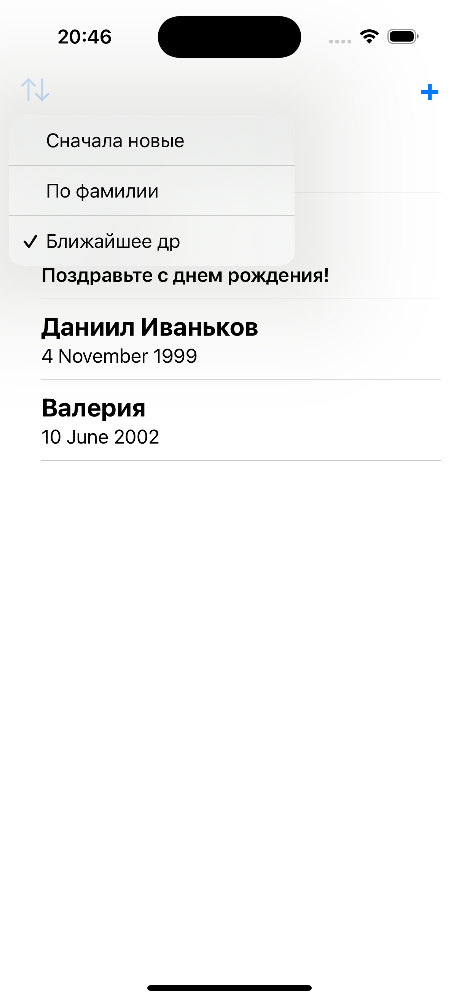

# BirthdayTracker

**BirthdayTracker** — это простое приложение для отслеживания дней рождения, написанное полностью на SwiftUI с использованием SwiftData.

## Возможности

- Добавление и удаление дней рождения
- Отображение списка с сортировкой:
  - По фамилии
  - По ближайшей дате рождения
- Уведомления о приближающихся днях рождения
- Полностью реализовано с использованием SwiftData и SwiftUI

## Скриншоты

| Добавление | Список | Сортировка |
|-----------|--------|------------|
|  |  |  |

## Клонирование проекта

```bash
git clone https://github.com/IvankovDaniil/BirthdayTracker.git
cd BirthdayTracker
```